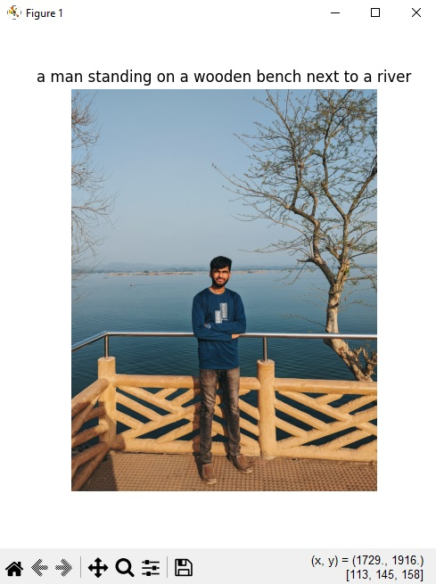

# Image Caption Generator

This is a simple image caption generator using NLP techniques. It uses a pre-trained ViT-GPT2 model to generate descriptive captions for images.

## Setup

1. Create a virtual environment (optional but recommended):
```
python -m venv .venv
source .venv/bin/activate  # On Windows, use: .venv\Scripts\activate
```

2. Install the required dependencies:
```
pip install -r requirements.txt
```

### Requirements
The project requires the following Python packages:
- torch>=1.9.0 - PyTorch for deep learning functionality
- transformers>=4.15.0 - Hugging Face Transformers for pre-trained models
- Pillow>=8.3.2 - For image processing
- matplotlib>=3.4.3 - For displaying images with captions
- numpy>=1.21.2 - For numerical operations
- argparse>=1.4.0 - For command-line argument parsing

Python 3.7 or later is recommended.

## Usage

### Basic Usage
Generate a caption for a single image:
```
python img_cap_gen.py --image path/to/your/image.jpg
```

### Process Multiple Images
Generate captions for all images in a directory:
```
python img_cap_gen.py --dir path/to/image/directory
```

### Options
- `--image`: Path to a single image file to caption
- `--dir`: Path to a directory containing images to caption
- `--no-display`: Add this flag to prevent images from being displayed 

## How It Works

The image caption generator uses a Vision Transformer (ViT) as an image encoder and GPT-2 as a text decoder. The process involves:

1. Loading and preprocessing the image
2. Extracting features from the image using the ViT model
3. Generating a natural language caption using GPT-2
4. Displaying the image with its caption

## Example

```
python img_cap_gen.py --image ahad.jpg
```


This will display the image with its generated caption and print the caption text to the console. 

## Contributing

Contributions to this project are welcome! Feel free to submit issues, feature requests, or pull requests to help improve this image caption generator.

## Contact

- GitHub: [https://github.com/AhadSiddiki](https://github.com/AhadSiddiki)
- Email: [ahad.siddiki25@gmail.com](mailto:ahad.siddiki25@gmail.com)
- LinkedIn: [http://www.linkedin.com/in/ahad-siddiki/](http://www.linkedin.com/in/ahad-siddiki/)
- Instagram: [www.instagram.com/ahad.siddiki/](https://www.instagram.com/ahad.siddiki/)

